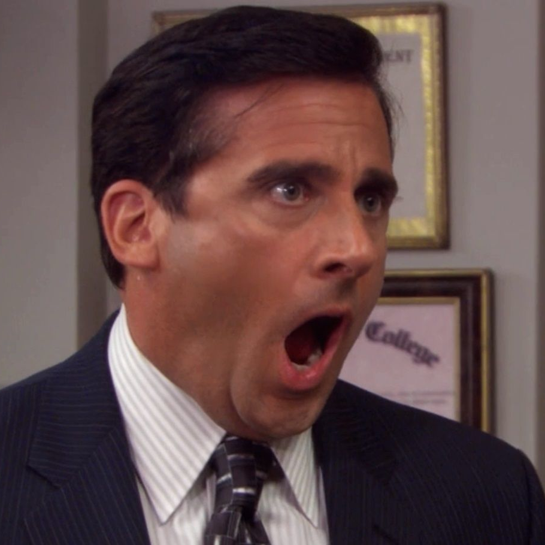
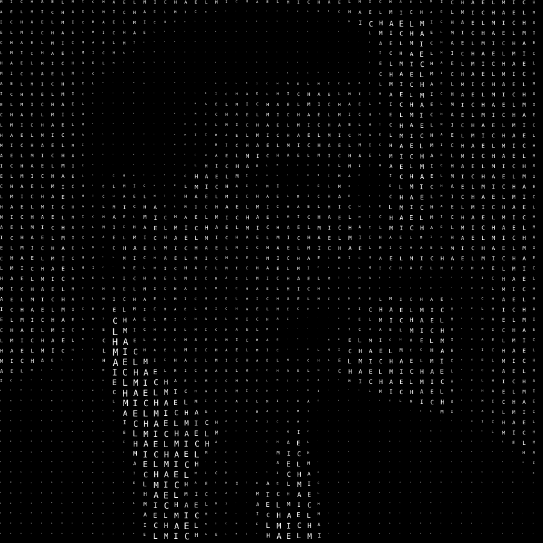

# Halftone Glyph: Image Converter

Halftone Glyph, a tool inspired by the [halftone](https://en.wikipedia.org/wiki/Halftone) printing technique, generates images in which pixels are substituted by characters.
The brightness of the pixel is encoded with the size of the character.

 

The tool can be used trough the command line program `hatogl` that is available for Windows, Mac, and Linux.


## Usage
Download from [here](https://github.com/lucarin91/HalftoneGlyph/releases) the correct version of the tool for your Operating System.
Extract the archive and move to a desirable location. Then, open a terminal and use it.

For instance the following command uses the characters `@`,`?`,`=`,`#` to draw the image `michael.png`:

```sh
hatogl data/michael.png --glyph="@?=#" --tile=15 --font=DejaVuSerif --out=michael_gliph.png
```
- `--glyph`, characters to be used
- `--tile`, maximum size of the characters
- `--font`, name or file of the font 
- `--out`, output path of the image

All the above parameters are optional, by default HalftoneGliph uses a system monospace font and the `@` character.
There is also the possibility to disable the randomness of the characters passing the `--no-random` parameter.

## Use as a Library
HalftoneGliph can be used also as a Rust library.
After including the library as dependency, use the function `image_to_unicode` to transform an image.


## Acknowledgment
HalftoneGlyph is implemented in Rust and uses [image](https://github.com/image-rs/image) to load and save images and [font-kit](https://github.com/servo/font-kit) to load fonts and render characters.

## License

MIT License
